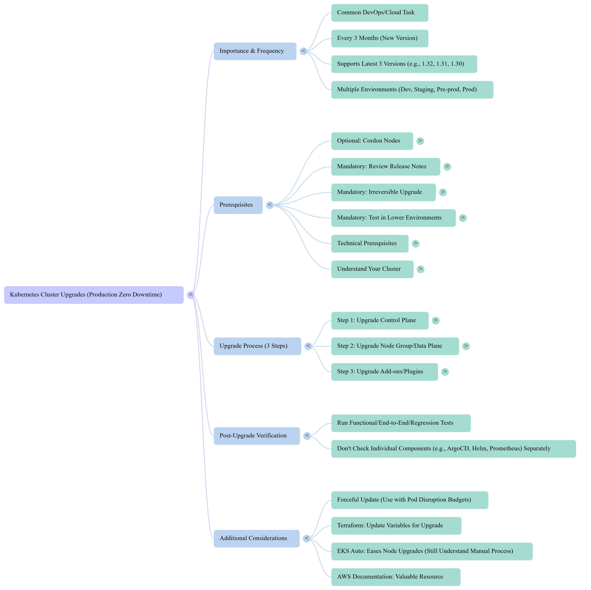

= Kubernetes Cluster Upgrades: A Comprehensive Study Guide
:toc:
:toclevels: 3
:icons: font
:sectnums:

== I. Core Concepts & Importance

=== What is a Kubernetes Cluster Upgrade?
The process of updating a Kubernetes cluster to a newer version, involving updates to:
- Control plane
- Data plane (nodes)
- Associated add-ons
=== Why are Upgrades Important?
- *Staying Supported*: Kubernetes generally supports only the latest three versions (e.g., 1.32, 1.31, 1.30).
- *Security*: New versions often include crucial security fixes.
- *New Features & Improvements*: Access to the latest functionalities and performance enhancements.
- *Common Task*: Often done once every 3 months by DevOps/Cloud Engineers.
- *Irreversibility*: Upgrades cannot be downgraded.
- *Zero Downtime*: Maintain uninterrupted services during the upgrade using rolling update strategies.
- *Managed Services*: EKS, AKS, GKE manage HA, DR, and API server scaling, but user initiates upgrades.

== II. Prerequisites for a Kubernetes Cluster Upgrade

=== Cordoning Nodes (Optional but Recommended)
- *Purpose*: Make nodes unschedulable to prevent new deployments.
- *Impact*: Existing workloads continue running.
- *When to Use*: Critical production upgrades or less experienced teams.

=== Reviewing Release Notes / Change Log
- *Crucial Step*: Understand changes between current and target versions.
- *Impacts*: API deprecations, behavior changes, pod security updates.
- *Skipping Risk*: Non-functional resources post-upgrade.

=== Testing in Lower Environments (Mandatory)
- *Order*: Dev → Staging → Pre-prod → Prod.
- *Grace Period*: 1-2 weeks between stages.
- *Reason*: Irreversible process.

=== Version Synchronisation
- Control plane and nodes must match before a major upgrade.
- Kubelet versions must be compatible with the control plane.
- Cluster Autoscaler must match control plane version.

=== Available IP Addresses
- Ensure at least 5 available IPs in the subnet used during initial cluster creation.

=== Understanding Your Cluster
- Know installed controllers, add-ons, networking setup.
- Essential for interpreting release notes.

== III. Kubernetes Cluster Upgrade Process

=== Step 1: Control Plane Upgrade
- Initiated via UI, CLI, or IaC tools.
- Managed services handle HA, DR, and scaling.
- *Timeframe*: ~25-30 minutes.

=== Step 2: Node Group / Data Plane Upgrade
- **Managed Node Groups (Rolling Updates)**: Cloud provider upgrades nodes progressively.
- **Self-Managed Nodes**: Manually cordon, drain, upgrade, uncordon.
- **New Node Group + Delete Old**: Suitable for smaller clusters.
- **Hybrid Approach**: Mix of methods.
- *Timeframe*: 30 minutes to several hours.

=== Step 3: Add-ons Upgrade
- Examples: `kube-proxy`, VPC CNI, CoreDNS.
- Check compatibility before upgrade.
- Use provider "Upgrade Insights" (EKS).

== IV. Post-Upgrade Verification & Troubleshooting

=== Verification
- Run functional / end-to-end tests.
- Avoid checking individual components if lower environments worked fine.

=== Future: EKS Auto
- Automates node upgrades, but understand manual process first.

== V. Key Tools & Technologies
- AWS EKS, Azure AKS, Google GKE
- `eksctl`, AWS CLI, Terraform
- AMI, Launch Templates, IAM OIDC Provider
- Pod Disruption Budgets (PDBs)

== VI. Related Questions

=== Instructions
Answer each question in 2-3 sentences.

1. What is the primary reason Kubernetes cluster upgrades are considered common tasks for DevOps and Cloud Engineers?
2. Why is it critically important to review release notes before performing a Kubernetes cluster upgrade?
3. Explain why testing Kubernetes cluster upgrades in lower environments is mandatory.
4. What is meant by "zero downtime" in the context of an upgrade?
5. Why must the control plane and nodes be on the same version before a major upgrade?
6. Describe the role of the kubelet during a Kubernetes cluster upgrade.
7. What aspect of upgrades still requires user action, even in managed services?
8. Outline the three primary steps for upgrading an EKS cluster.
9. What is the "rolling update" strategy for node group upgrades?
10. How should a successful Kubernetes cluster upgrade be verified?

== VII. Answer  

1. Kubernetes supports only the latest three versions; engineers must upgrade to maintain support, features, and security.
2. Release notes highlight API changes and deprecations; skipping them risks breaking workloads.
3. Lower environment testing reduces production risks since upgrades are irreversible.
4. Zero downtime means uninterrupted services, achieved with rolling updates.
5. Control plane and node version compatibility ensures stability.
6. The kubelet runs on each node to manage containers and must match/control plane version compatibility.
7. Users must manually initiate upgrades in managed services.
8. Control plane upgrade → Node group upgrade → Add-on upgrade.
9. Rolling update upgrades nodes one by one, keeping workloads running.
10. Run end-to-end functional tests to confirm workloads are healthy.

